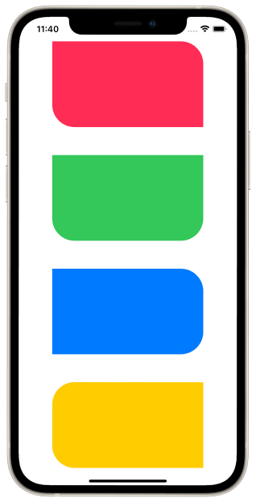

# CornerRoundedRectangle

A SwiftUI Shape that creates a rounded rectangle based on the corners that you choose. Example:

```swift
VStack(spacing: 50) {
    CornerRoundedRectangle(cornerRadius: 40, edges: [.topRight, .bottomLeft])
        .fill(.pink)
    CornerRoundedRectangle(cornerRadius: 40, edges: .bottom)
        .fill(.green)
    CornerRoundedRectangle(cornerRadius: 40, edges: .trailing)
        .fill(.blue)
    CornerRoundedRectangle(cornerRadius: 40, edges: .leading)
        .fill(.yellow)
}
.padding(.horizontal, 60)
```

Makes the following: 


